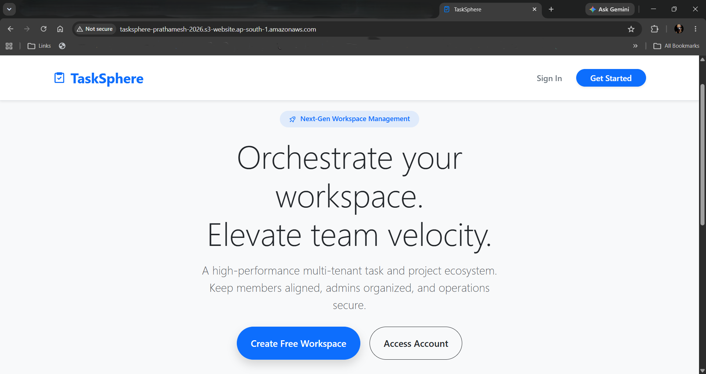
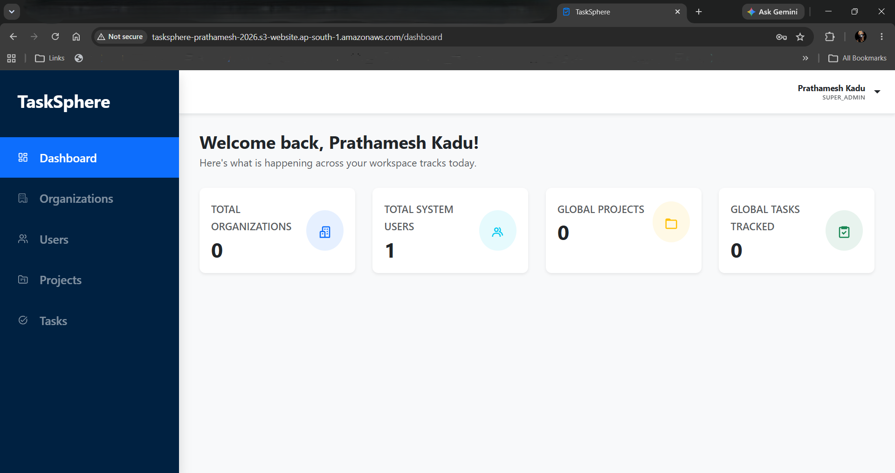
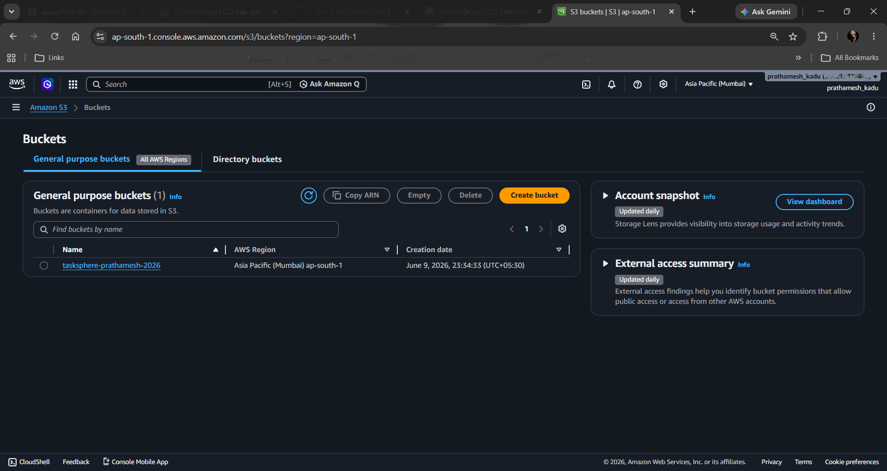
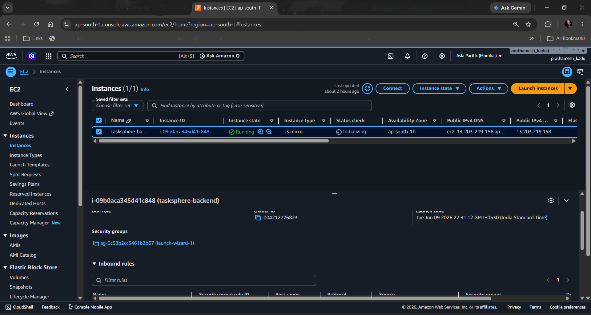
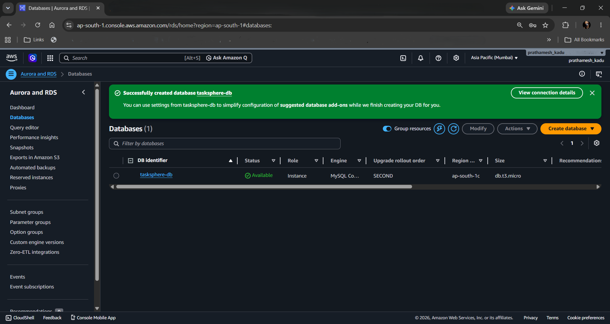

# TaskSphere

TaskSphere is a full-stack task and project management application that enables organizations to manage projects, tasks, and users through a secure role-based access system.

The application follows a hierarchical structure where Organizations contain Projects, and Projects contain Tasks, allowing teams to organize work efficiently and track progress across multiple projects.

TaskSphere supports multiple user roles, including Super Admin, Owner, Admin, and Member, ensuring that users can access and manage resources based on their responsibilities.

## Features

* Organization Management
* Project Management
* Task Management
* User Management
* Role-Based Access Control (RBAC)
* JWT Authentication and Authorization
* Protected Routes
* Responsive Dashboard
* Form Validation
* Server State Management
* Continuous Integration (CI)

## Tech Stack

### Frontend

* React
* TypeScript
* React Router DOM
* TanStack Query
* React Hook Form
* Zod
* Bootstrap
* Axios

### Backend

* Spring Boot
* Spring Security
* JWT Authentication
* Spring Data JPA
* Hibernate
* Maven

### Database

* MySQL

### DevOps & Cloud

* GitHub Actions (CI)
* Amazon S3
* Amazon EC2
* Amazon RDS

## Project Structure

```text
TaskSphere
│
├── backend
│
├── frontend
│
├── assets
│   ├── landing-page.png
│   ├── super-admin-dashboard.png
│   ├── aws-s3-hosting.png
│   ├── aws-ec2-backend.png
│   └── aws-rds-database.png
│
└── README.md
```

## Deployment Architecture

```text
                    ┌─────────────────┐
                    │  Amazon S3      │
                    │ React Frontend  │
                    └────────┬────────┘
                             │
                             ▼
                    ┌─────────────────┐
                    │  Amazon EC2     │
                    │ Spring Boot API │
                    └────────┬────────┘
                             │
                             ▼
                    ┌─────────────────┐
                    │  Amazon RDS     │
                    │     MySQL       │
                    └─────────────────┘
```

## CI Pipeline

GitHub Actions is configured to run Continuous Integration workflows on the `develop` branch. The pipeline validates code changes and ensures the application builds successfully before integration.

## AWS Deployment

The application was successfully deployed and validated on AWS using:

* Amazon S3 for frontend hosting
* Amazon EC2 for backend hosting
* Amazon RDS for MySQL database hosting

Deployment screenshots are included in this repository.

## Screenshots

### Landing Page



### Super Admin Dashboard



### Amazon S3 - Frontend Hosting



### Amazon EC2 - Backend Hosting



### Amazon RDS - MySQL Database


